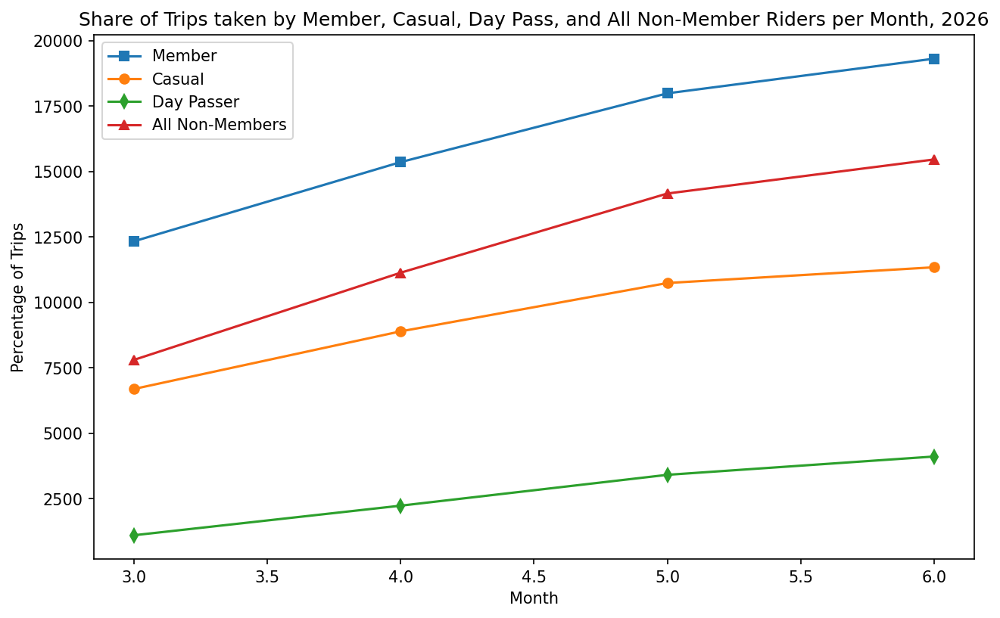
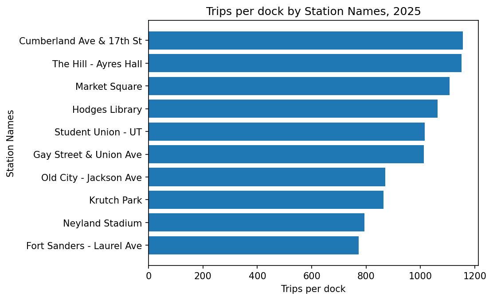

# Ride Knox Ridership Analysis

## Overview 
### The Day Pass Brought the Casual Riders Back, Campus Pressure was Relieved, and Member Riders Were Unaffected

### 2026 Chapter: Key Findings
The Day Pass brought casual riders back. The dock expansion and new station fix the campus crunch. One out of two idle stations from 2025 seem to still be sitting idle.

(1) Comparing March 2025 (before price increase) to March 2026 (after price increase, and after Day Pass was introduced), \~43% (19,716 total trips) to \~38% (20,145 total trips) of trips were taken by non-members. Comparing June 2025 to June 2026, \~44% (31,260 total trips) to \~44% (34,771 total trips) of trips were taken by non-members. Additionally, the median duration of trips for Casual riders and Member riders was consistent from 2025 - 2026. Day Pass riders had the highest median duration at 20.6 min/trip! In assessing the number of trips Day Pass riders are taking per hour, the pattern looks similar to those of Casual riders where most rides are being taken in the afternoon.

(2) The arrivals per dock for S06 and S08 have substantially declined from 2025 (average of about 53 arrivals/dock combined for both stations) to 2026 (average of about 36 arrivals/dock combined for both stations). For the idle stations (S24 and S23) from 2025, they both have the lowest trip count (981 and 1075 trips) and departures per dock (98.1 and 89.6 dep/dock). However, Bearden (S23), appears to be growing more/faster than Sequoyah (S24). For the new station (S25), it is in the top 10 for both the number of departures per dock and the total number of trips, even though it has only been in operation for 4 months!

To view the full 2026 memo, please visit [2026 Memo](2026_bundle/memo.md)

### 2025 Chapter: Key Findings
Of the 10 stations with the most pressure (according to trips per dock), there are four stations in the **UT Campus neighborhood** that are most pressured. However, there is near-idleness observed for both Bearden and Sequoyah Hills stations.

For the ridership question, in comparison to the increase in member riders, the number of casual riders drops significantly (10.4% out of 31,279 (June) - 26,926 (July) total riders) from June to July 2025 (see Member vs. Casual Trips per Month, 2025 chart above). For the pressure question, slack seems to be present especially in the UT Campus neighborhood, where there is a lot of pressure, but not a lot of docks (e.g., The Hill with only 12 docks but about 1,156 trips per dock, and Hodges and the Student Union with only 24 docks have about 1,063 and 1,015 trips per dock respectively, etc.). Additionally, there is roughly a 1,000-trip difference between the top and bottom stations. Also, see the Trips per dock by Station Names, 2025 chart above.

To view the full 2025 report, please visit [2025 Report](2025_bundle/report.md)

### Data
Raw files are **not** in this repo (~22 MB, and we believe you should never edit raw data).
We have schemas of our data below, but request raw data files from the Ride Knox data team.

*2025 bundle (~247,844 cleaned trips across 24 stations)*
*2026 bundle (~135,545 cleaned trips across 25 stations)*

`trips_2025.csv` and `trips_2026_h1.csv` — one row per trip:

| column                | type     | notes                                 |
| ----------------------| -------- | ------------------------------------- |
| trip_id               | str      | unique, T-series                      |
| start_time / end_time | datetime | stored as text in the raw file        |
| start_station_id      | str      | joins to stations.station_id          |
| start_station_name    | str      | authoritative names in stations.xlsx  |
| end_station_id        | str      | ~3,800 missing (kept and flagged)     |
| rider_type            | str      | member / casual (raw has 6 spellings) |
| bike_type             | str      | classic / electric                    |

`stations.xlsx` and `stations_2026.xlsx` — one row per station:

| column                | type     | notes                                 |
| ----------------------| -------- | ------------------------------------- |
| station_id            | str      | unique, T-series                      |
| station_name          | str      | authoritative names                   |
| neighborhood          | str      | broader location stations share       |
| latitude              | float    | Latitude location of each station     |
| longitude             | float    | Longitude location of each station    |
| docks                 | int      | number of docks                       |
| year_installed        | int      | year station was installed            |

### Tools/How to Run: Python, pandas, matplotlib
For both 2025 and 2026 notebooks: 
- Install [requirements.txt](requirements.txt)
- Open analysis.ipynb
- Restart & Run All

### Limitations

Our data for a few variables is only over a short period of time. There are stations that have been excluded because they were missing both end station IDs and end times. We should collect information from our rider that could be influencing their riding (e.g., reasons for riding, etc.). The one minute cutoff rule implemented in the analysis causes us to lose data points that may otherwise influence our analysis. We excluded trips longer than 24 hours (bikes likely never docked properly).

### Release Note
Will go here (still working)

### Repository README
For the technically curious, our [README.md](README.md) describing how to run the code used for these analyses can be viewed here.