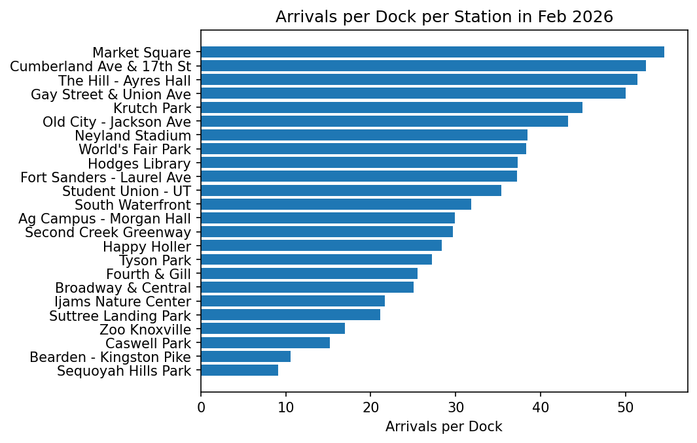

# *2026 Update: The Day Pass Brought the Casual Riders Back, Campus Pressure was Relieved, and Member Riders Were Unaffected.*

### 2026 Chapter

The Day Pass brought casual riders back. The dock expansion and new station fix the campus crunch. One out of two idle stations from 2025 seem to still be sitting idle.

To view the full 2026 memo, please visit [2026 Memo](2026_bundle/memo.md)

### 2025 Chapter

Both Members and Casual rider types seem to have a natural progression, then decline throughout the year. However, ridership does seem to be down for casual riders starting in July. Of the 10 stations with the most pressure (according to trips per dock), there are four stations in the UT Campus neighborhood and three stations in the Downtown neighborhood where we should consider adding stations. 

To read the full report from 2025, please view [2025 Report](2025_bundle/report.md)

### Release Note
Will go here (still working)

### Repository README
For the technically curious, our [README.md](https://github.com/zselman01/ride-knox-analysis/blob/master/README.md) describing how to run the code used for these analyses can be viewed here.